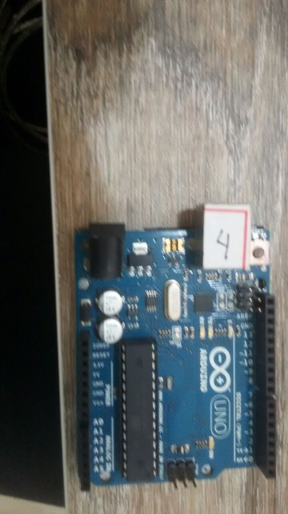
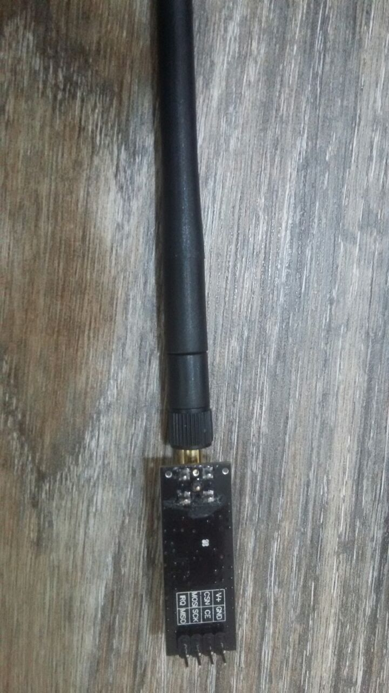

# Universidade Federal de Santa Catarina
### Disciplina Redes Sem Fio

#### Trabalho Final
##### Implementar um sistema de comunicação utilizando NRF24l01-PA-LNA

##### Nome dos integrantes do grupo
* Matheus Francisco B. Machado
* Ramon Tramontin 
* Luan Rodrigues
* Rafael Roxo
* Gabriel Astrix
* Eriel 

### Descrição do trabalho

Foi utilizado um Arduino Uno R3, mostrado na IMG
 

Também utilizou-se um shield feito para plugar o sensor

NRF24l01-PA-LNA
 

